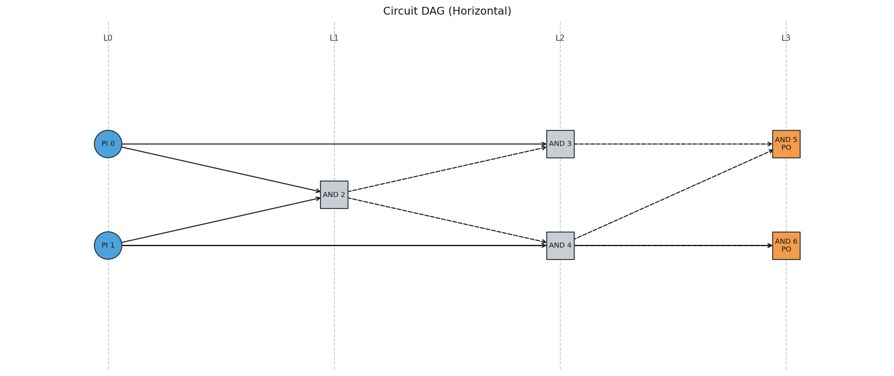
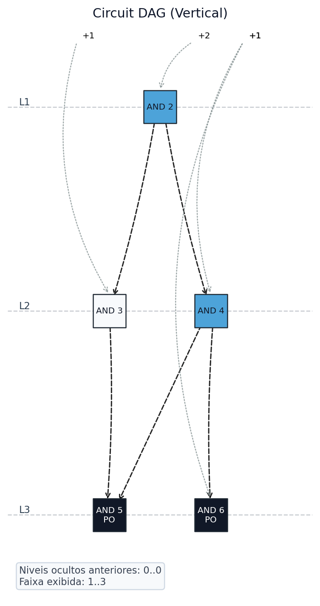
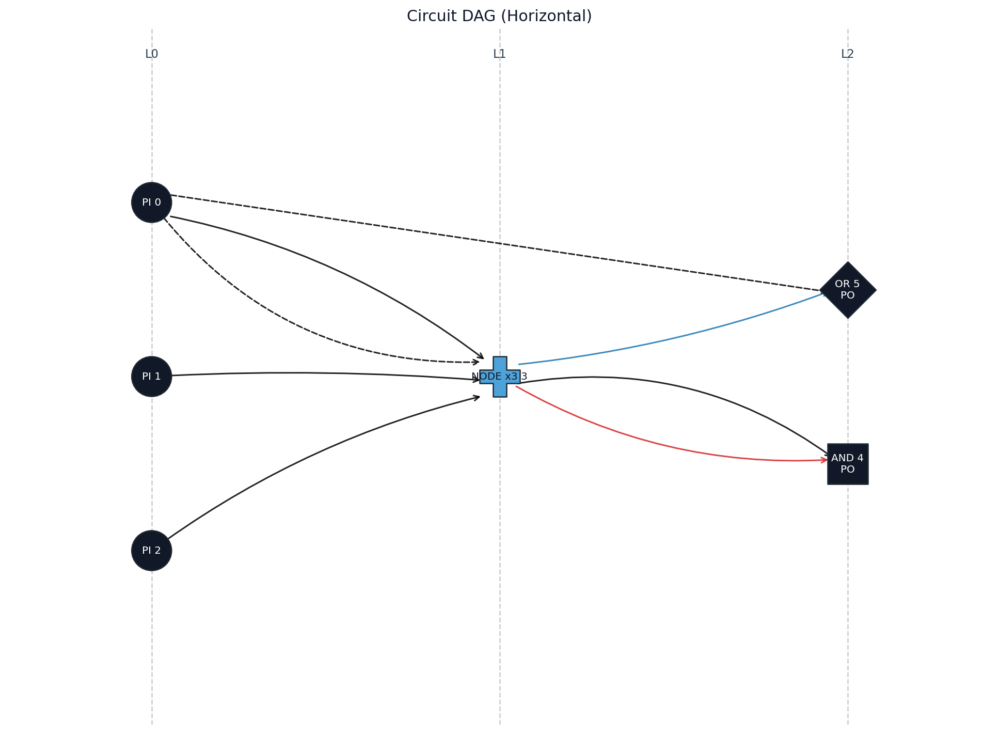

# ThermalBits

A library for inspecting combinational digital circuits from Verilog netlists, focusing on exploring energy limits based on Landauer's principle.

### Installation

With visualization support (matplotlib + networkx):

```bash
pip install -r requirements.txt

```

The entropy simulator is a Rust binary bundled under `thermalbits/iron_circuit_sim/`. Build it once before calling `update_entropy()`:

```bash
cd thermalbits/iron_circuit_sim
RUSTFLAGS="-C target-cpu=native" cargo build --release
```

**Packaging**

```bash
python -m build
```

Artifacts will be created in `dist/`.

### Features

* [x] Parse combinational Verilog netlists into an internal circuit representation.
* [x] Access and edit circuit data (`pi`, `po`, and `node`) directly in memory.
* [x] Export the current circuit state to JSON.
* [x] Generate Verilog from the current circuit state.
* [x] Visualize the circuit as a DAG image.
* [x] Create blank circuit objects and deep-copy existing ones.
* [x] Apply depth-oriented and energy-oriented fanout-chain transformations.
* [x] Compute total circuit Shannon entropy (Landauer information loss per gate).

## Usage Examples

### Generate Overview

Suppose you have a netlist `netlist.v` with combinational assignments. The circuit is generated automatically at initialization:

```python
from thermalbits import ThermalBits

tb = ThermalBits("netlist.v")
print(tb.pi)
print(tb.po)
print(tb.node[0])

```

You can also create a blank object and fill it manually:

```python
from thermalbits import ThermalBits

tb = ThermalBits()
tb.pi = [0, 1]
tb.po = [2]
tb.node = [
    {
        "id": 2,
        "fanin": [[0, 0], [1, 0]],
        "fanout": [{"input": [0, 1], "invert": [0, 0], "op": "&"}],
        "level": 1,
        "suport": [0, 1],
    }
]
```

To create a full copy of an existing object:

```python
from thermalbits import ThermalBits

tb = ThermalBits("netlist.v")
tb2 = tb.copy()
```

The internal properties are editable (`pi`, `po`, `node`). To save the current state to JSON:

```python
from thermalbits import ThermalBits

tb = ThermalBits("netlist.v")
tb.write_json("out.json")
```

The `out.json` file contains:

* `file_name`: Name of the source Verilog file.
* `pis`: Integer IDs of primary inputs.
* `pos`: Integer IDs of primary outputs.
* `nodes`: List of logic nodes in the format:
* `id`: Integer identifier of the node.
* `fanin`: List `[[node_id, output_index], ...]` describing where each local input comes from.
* `fanout`: List of outputs produced by the node. For Verilog-generated nodes, this list usually has one element.
* `input`: Local input positions consumed by one output.
* `invert`: Per-input inversion flags (`0` or `1`) aligned with `input`.
* `op`: Output operator (`&`, `|`, `^`, `M`, or `-`).
* `level`: Logic level of the node.
* `suport`: PI cone of the node (integer IDs).


### Apply Energy-Recovery Methods

`apply()` transforms the current circuit in memory using one of the available
fanout-chain methods. The implemented methods are based on the EO and DO
algorithms described in:

CHAVES, Jeferson F. et al. Enhancing fundamental energy limits of
field-coupled nanocomputing circuits. In: 2018 IEEE International Symposium on
Circuits and Systems (ISCAS). IEEE, 2018. p. 1-5.

Available methods:

| Constant | Method | Goal |
|---|---|---|
| `DEPTH_ORIENTED` | Depth-oriented / Delay-oriented (DO) | Reduce energy while preserving the original circuit depth. It selects at most one child per rank when building fanout chains. |
| `ENERGY_ORIENTED` | Energy-oriented (EO) | Maximize energy reduction. It can serialize multiple children in the same rank and may increase circuit depth. |

Basic usage:

```python
from thermalbits import DEPTH_ORIENTED, ENERGY_ORIENTED, ThermalBits

tb = ThermalBits("netlist.v")

depth_tb = tb.copy().apply(DEPTH_ORIENTED)
energy_tb = tb.copy().apply(ENERGY_ORIENTED)

depth_tb.write_json("netlist_depth_oriented.json")
energy_tb.write_json("netlist_energy_oriented.json")
```

`apply()` mutates the object and returns the same instance, so it can be
chained with other calls. Use `copy()` first when you want to preserve the
original circuit:

```python
from thermalbits import ENERGY_ORIENTED, ThermalBits

tb = ThermalBits("netlist.v")
transformed = tb.copy().apply(ENERGY_ORIENTED)

original_entropy = tb.update_entropy(chunks=None)
transformed_entropy = transformed.update_entropy(chunks=None)

print(original_entropy)
print(transformed_entropy)
```

### Visualize Graph

To visualize the circuit as a DAG (Directed Acyclic Graph):

```python
from thermalbits import ThermalBits

tb = ThermalBits("test_files/half_adder.v")
tb.visualize_dag(
    output_path="dag_horizontal.png",
    orientation="horizontal",      # or "vertical"
    level_window=[1, 3],           # optional: shows only levels 1..3
)
```

#### Node styling

All nodes are drawn as circles. Primary inputs are shown as black nodes.
Internal gates and primary outputs are white by default. A gate is highlighted
in blue only when its fanout entries use different operators, such as an `&`
output plus a WIRE (`-`) output.

Primary outputs are marked outside the node with a short output line labeled
`PO0`, `PO1`, and so on. Non-PI node labels use the node id minus the number of
PIs plus the operation symbol, for example `& 0`.

#### Edge styling

The renderer encodes extra information on the edges themselves:

* **Dashed lines** mark inputs that are inverted by the consumer gate (the
  destination node applies a `~` to that fanin before the operation).
* **Colors** identify which fanout (output index) of the source node drives
  the edge. This is only visible on nodes with more than one `fanout` entry,
  since the Python parser always emits a single output per `assign`. The
  palette cycles through:

  | Source output index | Color |
  |---|---|
  | 0 | black |
  | 1 | red |
  | 2 | blue |
  | 3 | green |
  | 4 | purple |
  | 5 | orange |
  | 6 | cyan |
  | 7 | brown |

  Higher indices wrap around the same palette.

The images below were generated using `test_files/half_adder.v`:

**Horizontal (all levels):**



**Vertical (levels 1..3 only):**



To get these exact images in your environment:

```python
from thermalbits import ThermalBits

tb = ThermalBits("test_files/half_adder.v")
tb.visualize_dag(
    output_path="dag_horizontal_test.png",
    orientation="horizontal",
)
tb.visualize_dag(
    output_path="dag_vertical_window_test.png",
    orientation="vertical",
    level_window=[1, 3],
)
```

To see the fanout color scheme in action, apply the energy-oriented
optimization to the same half adder. The transformation adds WIRE fanouts to
serialize repeated uses of the same signal, so nodes with functionally distinct
fanout entries are highlighted and their output indices are drawn with
different edge colors:

```python
from thermalbits import ENERGY_ORIENTED, ThermalBits

tb = ThermalBits("test_files/half_adder.v").apply(ENERGY_ORIENTED)
tb.visualize_dag(
    output_path="dag_multi_output_test.png",
    orientation="horizontal",
)
```



Note how the optimized half adder keeps the original logic outputs while adding
WIRE outputs for serialized fanout. Dashed edges still mark inverted inputs.

If necessary, install the visualization dependency:

```bash
pip install matplotlib networkx
```

### Convert to Verilog

To convert an circuit back to Verilog:

```python
from thermalbits import ThermalBits

tb = ThermalBits("netlist.v")
tb.write_verilog("reconstructed.v")
```

Optionally, you can define the module name:

```python
from thermalbits import ThermalBits

tb = ThermalBits("netlist.v")
tb.write_verilog("reconstructed.v", module_name="MyModule")
```

### Compute Shannon Entropy

`update_entropy()` simulates the entire circuit and computes the total Shannon entropy — the sum of information discarded by every logic gate:

```
H_total = Σ_gates [ H(A, B) − H(Y) ]
```

where `H(A, B)` is the joint entropy of the two gate inputs and `H(Y)` is the entropy of its output. This quantity directly maps to the minimum thermodynamic energy dissipation via Landauer's principle (`kT ln 2` per bit erased).

The result is stored in `self.entropy` (in bits) and also returned.

#### Mode selection

The method accepts two parameters:

| Parameter | Description |
|---|---|
| `chunks` | Total number of chunks the circuit is divided into |
| `parallel_chunks` | How many chunks can be executed simultaneously (default: `2`) |

| Call | Mode used |
|---|---|
| `update_entropy()` | **Chunk** — 2 chunks, 2 running simultaneously |
| `update_entropy(chunks=N)` | **Chunk** — `N` chunks total, 2 running simultaneously |
| `update_entropy(chunks=N, parallel_chunks=P)` | **Chunk** — `N` chunks total, `P` running simultaneously |
| `update_entropy(chunks=None)` and max gate support ≤ 25 | **Full** — per-gate truth tables (`2^k` rows each) |

#### Usage

```python
from thermalbits import ThermalBits

tb = ThermalBits("netlist.v")

# Default mode: 2 chunks, 2 running simultaneously
entropy = tb.update_entropy()
print(entropy)       # total entropy in bits
print(tb.entropy)    # same value stored on the object
```

To control the number of chunks and simultaneous execution explicitly:

```python
# Divide into 64 chunks, process 8 at a time
entropy = tb.update_entropy(chunks=64, parallel_chunks=8)
```

To maximise throughput when many CPU cores are available:

```python
# 128 chunks, all dispatched simultaneously
entropy = tb.update_entropy(chunks=128, parallel_chunks=128)
```

To force full mode on circuits with manageable support:

```python
entropy = tb.update_entropy(chunks=None)
```

Chunks are dispatched in successive batches of `parallel_chunks` until all `chunks` have been processed. Chunk results are merged automatically; temporary binary files are created and deleted in a system temp directory.

#### When to use chunk mode

| n_pis | Full table size | Recommendation |
|---|---|---|
| ≤ 20 | ≤ 1 M rows | `chunks=2` by default; `chunks=None` keeps full mode viable |
| 21–25 | 2 M – 33 M rows | `chunks=2` is usually fine; full mode is still feasible with `chunks=None` |
| 26–35 | 64 M – 34 G rows | Chunk mode, `chunks` ≈ 32–1024 |
| > 35 | > 34 G rows | Chunk mode mandatory; use many chunks |

> **Note:** chunk mode requires n_pis ≤ 63 (hardware limit of the 64-bit simulator).

### Batch CSV reports

To run the entropy flow over all Verilog files in a directory and save a CSV report:

```bash
python run_tests.py test_files -o entropy_results.csv --chunks 2 --parallel_chunks 2
```

By default, the script records three versions for each circuit: `original`, `eo` (energy-oriented optimization), and `do` (depth-oriented optimization). To restrict the report, use `--energy-oriented` or `--depth-oriented`; the original circuit is still included as the baseline.

The CSV columns are:

```text
file,method,size,depth,energy,entropy_time_s,image_path
```

`entropy_time_s` is the time spent calculating entropy for that circuit/method pair. `image_path` is empty unless image generation is enabled.

To also generate circuit images:

```bash
python run_tests.py test_files -o entropy_results.csv --images-dir dag_outputs --image-orientation horizontal
```

Use `--image-orientation vertical` to save vertical DAG images instead. Files that fail to parse or process are reported on stderr, and successful rows are still written to the CSV.

## Observations
* Assignments support `&`, `|`, and `~` (no `^`, `+`, etc.). One-bit constants `1'b0` and `1'b1` are also accepted.
* Each `assign` generates one node with a single `fanout` entry. Unary assignments are emitted with `op: "-"`.
* Input/output paths can be absolute or relative to the current directory.
