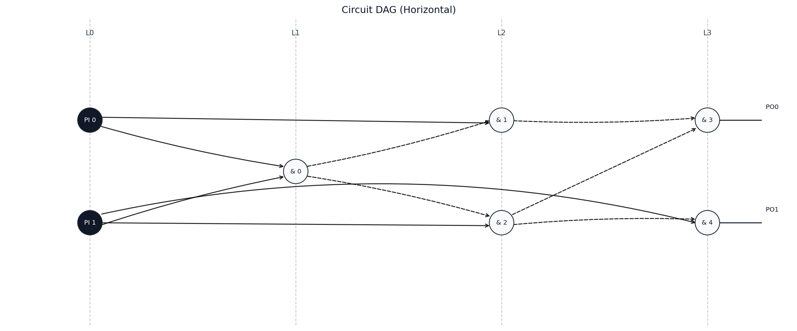
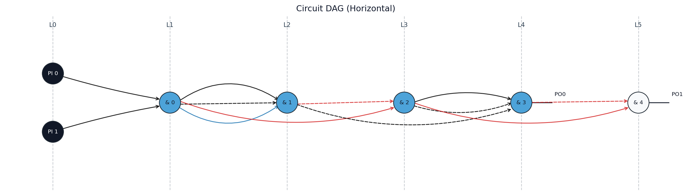
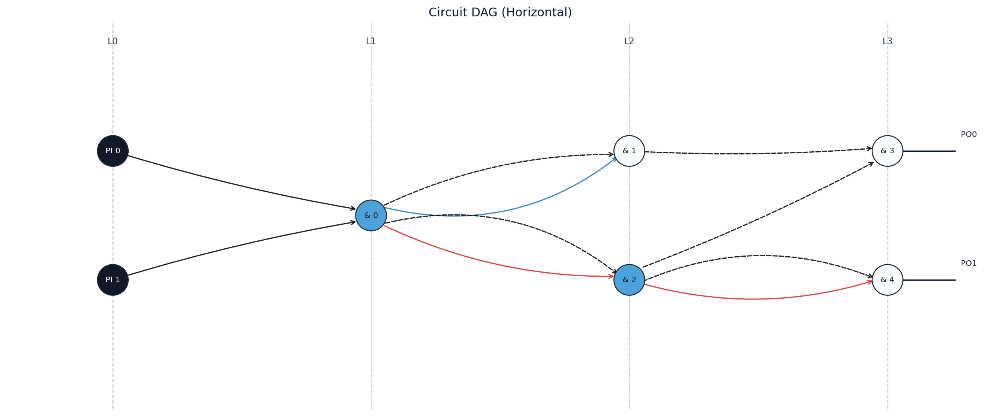

# Apply Optimizations

`apply()` transforms the in-memory circuit with one of the registered methods.
The available methods are exported by the package:

```python
from thermalbits import DEPTH_ORIENTED, ENERGY_ORIENTED, ThermalBits
```

## Methods

| Constant | Method | Goal |
|---|---|---|
| `ENERGY_ORIENTED` | Energy-oriented (EO) | Maximize energy reduction, allowing circuit depth to increase. |
| `DEPTH_ORIENTED` | Depth-oriented / Delay-oriented (DO) | Reduce energy while preserving the original circuit depth. |

The implemented methods are based on the EO and DO algorithms described in:

CHAVES, Jeferson F. et al. Enhancing fundamental energy limits of
field-coupled nanocomputing circuits. In: 2018 IEEE International Symposium on
Circuits and Systems (ISCAS). IEEE, 2018. p. 1-5.

The depth-oriented method selects at most one child per rank when building
fanout chains. The energy-oriented method can serialize multiple children in
the same rank and may increase circuit depth.

## Apply a transformation

`apply()` mutates the object and returns the same instance.

```python
from thermalbits import ENERGY_ORIENTED, ThermalBits

tb = ThermalBits("test_files/half_adder.v")
tb.apply(ENERGY_ORIENTED)
```

To keep the original circuit:

```python
from thermalbits import DEPTH_ORIENTED, ENERGY_ORIENTED, ThermalBits

original = ThermalBits("test_files/half_adder.v")

depth_tb = original.copy().apply(DEPTH_ORIENTED)
energy_tb = original.copy().apply(ENERGY_ORIENTED)
```

## Compare energy

```python
from thermalbits import ENERGY_ORIENTED, ThermalBits

original = ThermalBits("test_files/half_adder.v")
optimized = original.copy().apply(ENERGY_ORIENTED)

original_energy = original.update_entropy(chunks=None)
optimized_energy = optimized.update_entropy(chunks=None)

print(original_energy)
print(optimized_energy)
```

## Half adder comparison

The table below uses `test_files/half_adder.v` and `update_entropy(chunks=None)`.

| Circuit | Gates | Levels | Energy (bits) |
|---|---:|---:|---:|
| Original | 5 | 3 | 3.754888 |
| Energy-oriented | 5 | 5 | 0.688722 |
| Depth-oriented | 5 | 3 | 1.877444 |

### Original



### Energy-oriented



### Depth-oriented



## Export the optimized circuit

```python
optimized.write_json("half_adder_eo.json")
optimized.write_verilog("half_adder_eo.v", module_name="half_adder_eo")
optimized.visualize_dag("half_adder_eo.png", orientation="horizontal")
```
