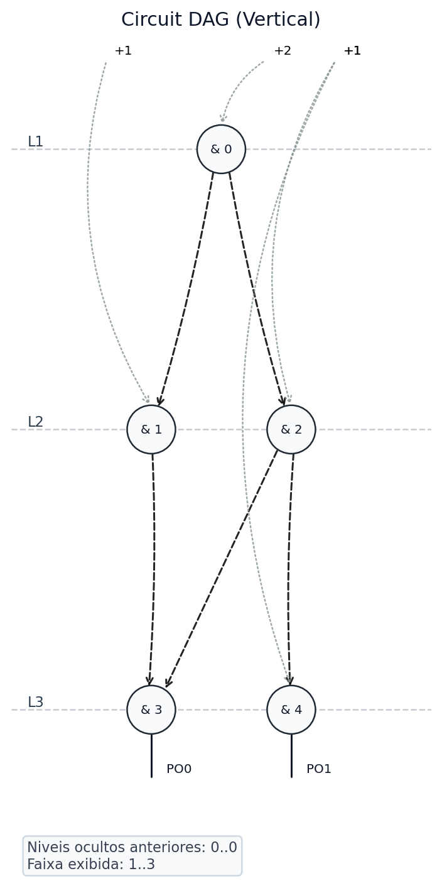

# DAG Visualization

`visualize_dag()` renders the circuit as a directed acyclic graph. The
implementation uses NetworkX to order the levels and Matplotlib to render the
image.

```python
from thermalbits import ThermalBits

tb = ThermalBits("test_files/half_adder.v")
tb.visualize_dag(
    output_path="half_adder_horizontal.png",
    orientation="horizontal",
)
```

## Orientation

```python
tb.visualize_dag("half_adder_horizontal.png", orientation="horizontal")
tb.visualize_dag("half_adder_vertical.png", orientation="vertical")
```

## Level window

Use `level_window=[start, end]` to render only a level range:

```python
tb.visualize_dag(
    output_path="half_adder_l1_l3.png",
    orientation="vertical",
    level_window=[1, 3],
)
```

## Examples

The images below are generated from `test_files/half_adder.v`.

### Horizontal layout


### Vertical level window



### Energy-oriented fanout colors


To generate this example, apply the energy-oriented optimization before
rendering:

```python
from thermalbits import ENERGY_ORIENTED, ThermalBits

tb = ThermalBits("test_files/half_adder.v").apply(ENERGY_ORIENTED)
tb.visualize_dag(
    output_path="dag_multi_output_test.png",
    orientation="horizontal",
)
```

The optimized half adder keeps the original logic outputs while adding WIRE
outputs for serialized fanout. Dashed edges still mark inverted inputs.

## Visual conventions

| Element | Convention |
|---|---|
| PI | Black circular node labeled `PI <id>`. |
| Internal gate | White circular node by default. |
| Fanout with different functions | Blue circular node. |
| PO | Normal node with a short external line labeled `PO0`, `PO1`, etc. |
| Inverted input | Dashed edge. |
| Fanout index | Edge color based on the source node output index. |

Gates are colored blue only when the same node has fanout entries with different
operators. If the fanout repeats the same function for more than one destination,
the node keeps the default color.

## Node labels

Primary inputs use `PI <id>`. Other nodes use the operation symbol and the ID
adjusted by `node_id - number_of_PIs`.

Examples:

```text
& 0
| 1
^ 2
M 3
```

## Edge colors by fanout

| Output index | Color |
|---|---|
| `0` | black |
| `1` | red |
| `2` | blue |
| `3` | green |
| `4` | purple |
| `5` | orange |
| `6` | cyan |
| `7` | brown |

Higher indexes reuse the same palette cyclically.

## Visualization dependencies

Install the visualization dependencies if they are not already available:

```bash
python -m pip install matplotlib networkx
```
